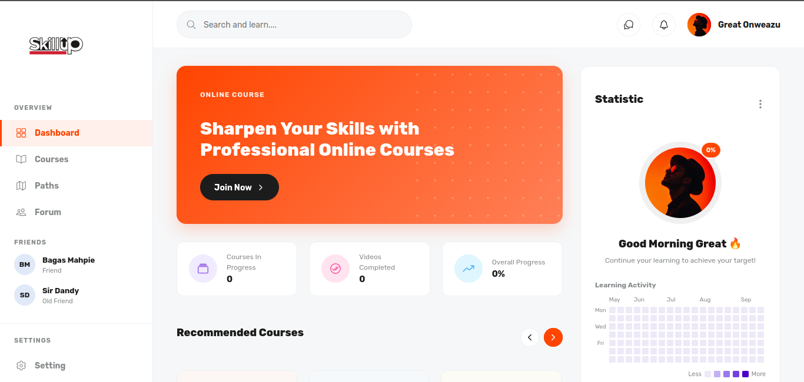

<p align="center"><a href="" target="_blank"></a></p>

## About SkillUp

SkillUp is a modern, student-centric learning platform designed to bridge the gap between amateur practice and professional job-readiness. It focuses on high-impact skills in coding, design, and product thinking through a structured, interactive experience.

### Key Features

- **Curated Learning Paths**: From "Coding Fundamentals" to "Product Design Sprints," our paths are built to take learners from zero to portfolio-ready.
- **Interactive Course Player**: Integrated with YouTube API for real-time progress tracking and persistent learning sessions.
- **Community-Driven Learning**: Collaborative learning prompts and weekly accountability check-ins through "SkillUp Club."
- **Mentor Check-ins**: Focused feedback sessions to help translate practice into professional narratives.
- **Personalized Dashboards**: Track your progress across multiple paths and manage your learning journey in one place.

## Technology Stack

- **Framework**: Laravel 11
- **Real-time**: Livewire & Alpine.js
- **Styling**: Tailwind CSS & Modern Vanilla CSS
- **Integrations**: YouTube Data API v3
- **Database**: MySQL / PostgreSQL

## Getting Started

### Prerequisites

- PHP 8.2+
- Composer
- Node.js & NPM
- YouTube API Key (for course videos)

### Installation

1. **Clone the repository**
   ```bash
   git clone https://github.com/Gr8a5t/skill-up.git
   cd skill-up
   ```

2. **Install dependencies**
   ```bash
   composer install
   npm install
   ```

3. **Environment Setup**
   ```bash
   cp .env.example .env
   php artisan key:generate
   ```
   *Note: Add your `YOUTUBE_API_KEY` to the `.env` file.*

4. **Run Migrations**
   ```bash
   php artisan migrate --seed
   ```

5. **Start the Development Server**
   ```bash
   npm run dev
   php artisan serve
   ```

## Contributing

We welcome contributions! If you'd like to help improve SkillUp, please check out the issues page or submit a pull request.

## License

The SkillUp platform is open-sourced software licensed under the [MIT license](https://opensource.org/licenses/MIT).

