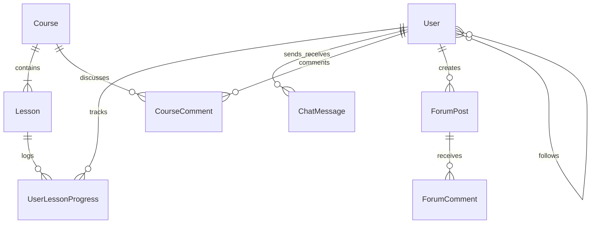

# SkillUp — Student-Centric Learning Platform

<p align="center">
  <a href="https://skill-up-xbt3.onrender.com" target="_blank">
    
  </a>
</p>

<p align="center">
  
  
  
  
  
  
</p>


SkillUp is a modern, student-centric learning platform designed to bridge the gap between academic study and professional job-readiness. It guides students through critical career skills—such as coding, UI/UX design, and product thinking—using structured learning paths, private peer-to-peer chats, a collaborative community forum, and interactive video workspaces.

---

## 🚀 Technology Stack

SkillUp is built as a single-page application (SPA) combining a modern TypeScript frontend with a robust, secure PHP backend.

### Frontend
- **Framework:** React (TypeScript)
- **SPA Bridge:** Inertia.js (enables a seamless SPA experience without building a separate client-side API)
- **Styling:** Custom Vanilla CSS for rich animations and layouts, integrated with TailwindCSS utilities
- **Build Tool:** Vite
- **Integrations:** YouTube Iframe Player API (for video lessons and progress sync), Ionicons (UI icons)

### Backend
- **Framework:** Laravel 11 (PHP 8.2+)
- **Routing & State:** Inertia Controllers & Middleware
- **Security:** CSRF Protection, HashID Obfuscated Routing, and Authentication Guards
- **Testing:** Pest PHP (for feature and unit test suites)

### Database
- **Database:** SQLite
- **ORM:** Eloquent ORM

---

## 📁 Workspace & Folder Directory Structure

```text
skill-up/
├── app/                           # Backend Application Logic
│   ├── Http/
│   │   ├── Controllers/           # Handles Inertia Page Controllers (Dashboard, Course, Profile, Chat, Forum)
│   │   └── Middleware/            # Handles Session, CSRF, and Inertia shared data
│   ├── Models/                    # Eloquent Database Models (User, Course, Lesson, ChatMessage, etc.)
│   └── Utils/                     # Utility helpers (e.g., HashId encoding/decoding)
├── bootstrap/                     # App bootstrapping configuration
├── config/                        # Laravel Configuration files (app, database, inertia, auth, etc.)
├── database/                      # Database Files
│   ├── factories/                 # Eloquent Factories for testing
│   ├── migrations/                # Database migrations defining the schema
│   └── seeders/                   # Database Seeders for populating initial courses/users
├── public/                        # Static assets (images, icons, build assets)
├── resources/
│   ├── frontend/                  # React Frontend Assets
│   │   ├── Components/            # Reusable UI components (Header, Footer, etc.)
│   │   ├── Layouts/               # SPA Layout wrappers (DashboardLayout, FitLifeLayout)
│   │   ├── Pages/                 # Inertia SPA Pages
│   │   │   ├── Profile/           # Profile Show and Edit pages
│   │   │   ├── About.tsx          # General About page
│   │   │   ├── Chats.tsx          # Private messaging feed
│   │   │   ├── CourseDetail.tsx   # Pathway structure details
│   │   │   ├── CourseLearn.tsx    # Interactive lesson workspace with Monaco code editor
│   │   │   ├── Courses.tsx        # Directory of all learning paths
│   │   │   ├── Dashboard.tsx      # Main student dashboard with progress metrics & heatmap
│   │   │   └── Forum.tsx          # Community discussion page
│   │   ├── app.tsx                # Client-side root entry point
│   │   └── global.d.ts            # Custom TypeScript declarations (IonIcons, window.YT, etc.)
│   └── views/
│       └── app.blade.php          # Main HTML layout template (Inertia root target)
├── routes/
│   └── web.php                    # Web routes mapping URL endpoints to Inertia Controllers
├── tests/                         # Pest Unit & Feature Test Suites
├── tsconfig.json                  # TypeScript compiler options and workspace paths
└── vite.config.js                 # Vite bundling configuration
```

---

## 🗄️ Database Schema & Workflows

SkillUp uses a relational SQLite database with the following core entities and relationships:



### Database Entities & Eloquent Models

#### 1. Users (`User.php`)
Stores student accounts, profile bios, location, and social links.
- **HashID Route Obfuscation:** To prevent user enumeration attacks and scraping, user routes use obfuscated `route_key` values in URLs (e.g., `/profile/x8y2z1` instead of public numeric IDs `/profile/1`). This mapping is handled automatically by custom `getRouteKey()` and `resolveRouteBinding()` overrides on the model.
- **Relationships:**
  - `followers()` / `following()`: Many-to-many self-referencing relationship mapping user connections on the `followers` pivot table.

#### 2. Courses (`Course.php`) & Lessons (`Lesson.php`)
Represents the pathways structure.
- **Courses:** Represents a skill pathway (e.g., "Coding Fundamentals"). Contains tags, concepts list (JSON cast), duration, and recap details.
- **Lessons:** Individual video chapters within a course. Links directly to a YouTube video via `video_id`.
- **Relationships:** A Course has a one-to-many relationship with Lessons.

#### 3. User Lesson Progress (`UserLessonProgress.php`)
Tracks real-time progress as students watch course videos.
- Logs `progress_seconds` (current playback mark) and a boolean `completed` state.
- **Workflow:** When watching a video inside the workspace (`CourseLearn.tsx`), the page uses the YouTube Player API to periodically ping `/api/progress` with the current video timestamp, syncing progress directly to the database.

#### 4. Chat Messages (`ChatMessage.php`)
Handles 1-on-1 private messaging between students.
- Logs `sender_id`, `recipient_id`, `message`, and `read_at` timestamp.
- **Workflow:** The `Chats.tsx` page performs silent polling to reload the message feed and online active user list without reloading the client SPA.

#### 5. Course Comments (`CourseComment.php`)
Provides structured discussion threads beneath lessons.
- Supports threaded conversations (replies map via `parent_id` foreign key self-relation) and likes (stored in a JSON array of user IDs).

#### 6. Forum Posts (`ForumPost.php`) & Comments (`ForumComment.php`)
Powers the community dashboard. Allows students to post queries, share updates, and reply to posts.

---

## 🛠️ Setup & Running Locally

### Prerequisites
- PHP 8.2+ with SQLite extension enabled
- Composer
- Node.js (v18+) & NPM

### Installation

1. **Clone & Navigate**
   ```bash
   git clone https://github.com/Gr8a5t/skill-up.git
   cd skill-up
   ```

2. **Backend Dependencies**
   ```bash
   composer install
   ```

3. **Frontend Dependencies**
   ```bash
   npm install
   ```

4. **Environment Configuration**
   ```bash
   cp .env.example .env
   php artisan key:generate
   ```

5. **Local Database Migration & Seeding**
   This compiles the database tables and inserts demo courses, lessons, and test users.
   ```bash
   php artisan migrate --seed
   ```

### Running the App

1. **Build and Watch Frontend Assets**
   ```bash
   npm run dev
   ```

2. **Start Backend Dev Server**
   ```bash
   php artisan serve
   ```
   *The application will be running at `http://127.0.0.1:8000` (or the port shown in your terminal).*

### Running Tests
To run the automated feature and unit test suites:
```bash
./vendor/bin/pest
```
